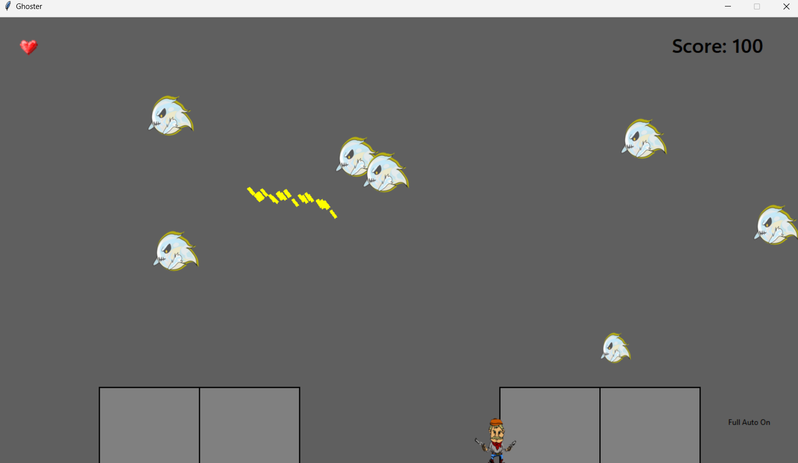

# Ghoster: Simple Ghost Shooting Game

Ghoster is a simple ghost shooting game created in Python using the Tkinter library. It features an object-oriented programming (OOP) structure and includes various game elements such as pausing, saving, a leaderboard, boss keys, and cheat codes.

## Table of Contents

1. [Features](#features)
2. [Technologies Used](#technologies-used)

## Features

- Simple ghost shooting gameplay.
- Object-oriented programming (OOP) structure.
- Pause and resume gameplay.
- Save and load game progress.
- Leaderboard to track high scores.
- Boss keys for discreetly pausing the game.
- Cheat codes for additional fun.

## Technologies Used

- Python
- Tkinter library

## Getting Started

Run main.py
